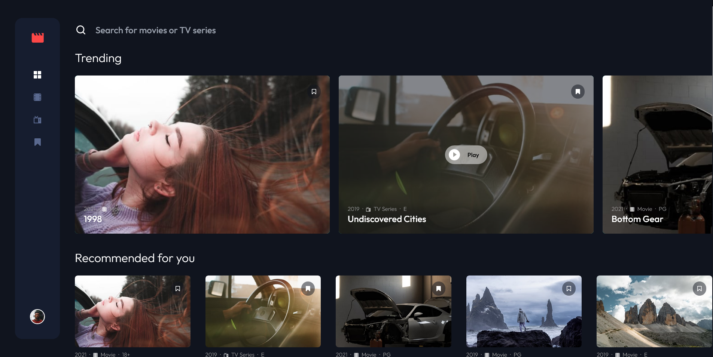

<!-- Please update value in the {}  -->

<h1 align="center">Entertainment App</h1>

<div align="center">
   Solution for a challenge from  <a href="https://www.frontendmentor.io" target="_blank">frontendmentor.io</a>.
</div>

<div align="center">
  <h3>
    <a href="https://fm-entertain-app.vercel.app/">
      Demo
    </a>
    <span> | </span>
    <a href="https://github.com/HermanLD/FM-entertain-app">
      Solution
    </a>
    <span> | </span>
    <a href="https://www.frontendmentor.io/challenges/entertainment-web-app-J-UhgAW1X">
      Challenge
    </a>
    <span> | </span>
    <a href="https://github.com/HermanLD/entertainment-app-api">
      Backend
    </a>
  </h3>
</div>

<!-- TABLE OF CONTENTS -->

## Table of Contents

- [Overview](#overview)
  - [Built With](#built-with)
- [Features](#features)
- [How to use](#how-to-use)
  - [Customize configuration](#customize-configuration)
  - [Recommended IDE Setup](#recommended-ide-setup)
- [Acknowledgements](#acknowledgements)
- [Contact](#contact)

### Built With



<!-- This section should list any major frameworks that you built your project using. Here are a few examples.-->

- [Vue.js](https://vuejs.org/)
- [Vite.js](https://vitejs.dev/)
- [Tailwindcss](https://tailwindcss.com/)

## Features

<!-- List the features of your application or follow the template. Don't share the figma file here :) -->

This application/site was created as a submission to a [Frontend Mentor](https://www.frontendmentor.io/challenges) challenge. The [challenge](https://www.frontendmentor.io/challenges/entertainment-web-app-J-UhgAW1X) was to build an application to complete the given user stories.

- View the optimal layout for the app depending on their device's screen size
- See hover states for all interactive elements on the page
- Navigate between Home, Movies, TV Series, and Bookmarked Shows pages
- Search for relevant shows on all pages
- Authentication (sign-up/login)
- Add/Remove bookmarks from all movies and TV series

## How To Use

To clone and run this application, you'll need [Git](https://git-scm.com) and [Node.js](https://nodejs.org/en/download/) (which comes with [npm](http://npmjs.com)) installed on your computer. From your command line:

```bash
# Clone this repository
$ git clone https://github.com/HermanLD/FM-entertain-app

# Install dependencies
$ npm install

# Compiles and hot-reloads for development
$ npm run dev

# Compiles and minifies for production
$ npm run build

# Run your unit tests [Vitest](https://vitest.dev/)
$ npm run test:unit

# Run your E2E tests [Cypress](https://cypress.io/)
$ npm run build
$ npm run test:e2e

# Lint with [ESLint](https://eslint.org/)
$ npm run lint

```

### Customize Configuration

- [Vite Configuration Reference](https://vitejs.dev/config/).
- [Vitest Unit Testing](https://vitest.dev/config/).
- [Cypress E2E Testing](https://docs.cypress.io/guides/references/configuration).

### Recommended IDE Setup

[VSCode](https://code.visualstudio.com/) + [Volar](https://marketplace.visualstudio.com/items?itemName=johnsoncodehk.volar) (and disable Vetur) + [TypeScript Vue Plugin (Volar)](https://marketplace.visualstudio.com/items?itemName=johnsoncodehk.vscode-typescript-vue-plugin).

## Acknowledgements

<!-- This section should list any articles or add-ons/plugins that helps you to complete the project. This is optional but it will help you in the future. For example: -->

- [“Everything Developers Need To Know About Figma” article on Smashing Magazine](https://www.smashingmagazine.com/2020/09/figma-developers-guide/)
- ["Introduction to Figma for Developers" video with Ryan Warner and Jason Lengstorf on Learn with Jason](https://www.learnwithjason.dev/introduction-to-figma-for-developers)
- [Replacement for require in Vuejs 3 with Vite for image array](https://stackoverflow.com/questions/70591125/replacement-for-require-in-vuejs-3-with-vite-for-image-array)
- [The Complete Node.js Developer Course](https://www.udemy.com/course/the-complete-nodejs-developer-course-2/)
- [Frontend Mentor](https://www.frontendmentor.io/)

## Contact

- Website [Portfolio](https://portfolio-olive-alpha.vercel.app/)
- GitHub [@HermanLD](https://github.com/HermanLD/)
- Twitter [@DardonHerman](https://twitter.com/DardonHerman/)
- Linkedin [herman-dardon](https://www.linkedin.com/in/herman-dardon/)
